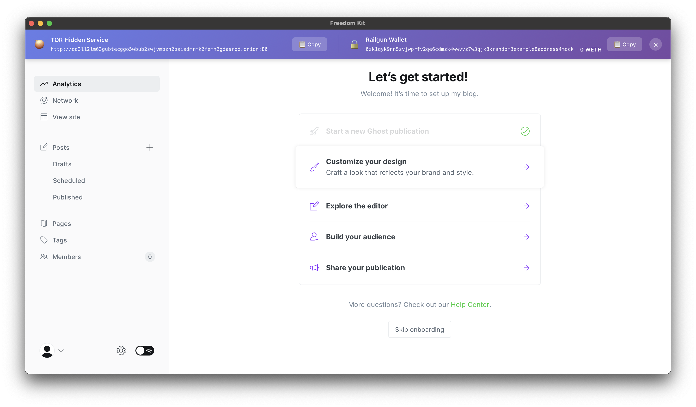
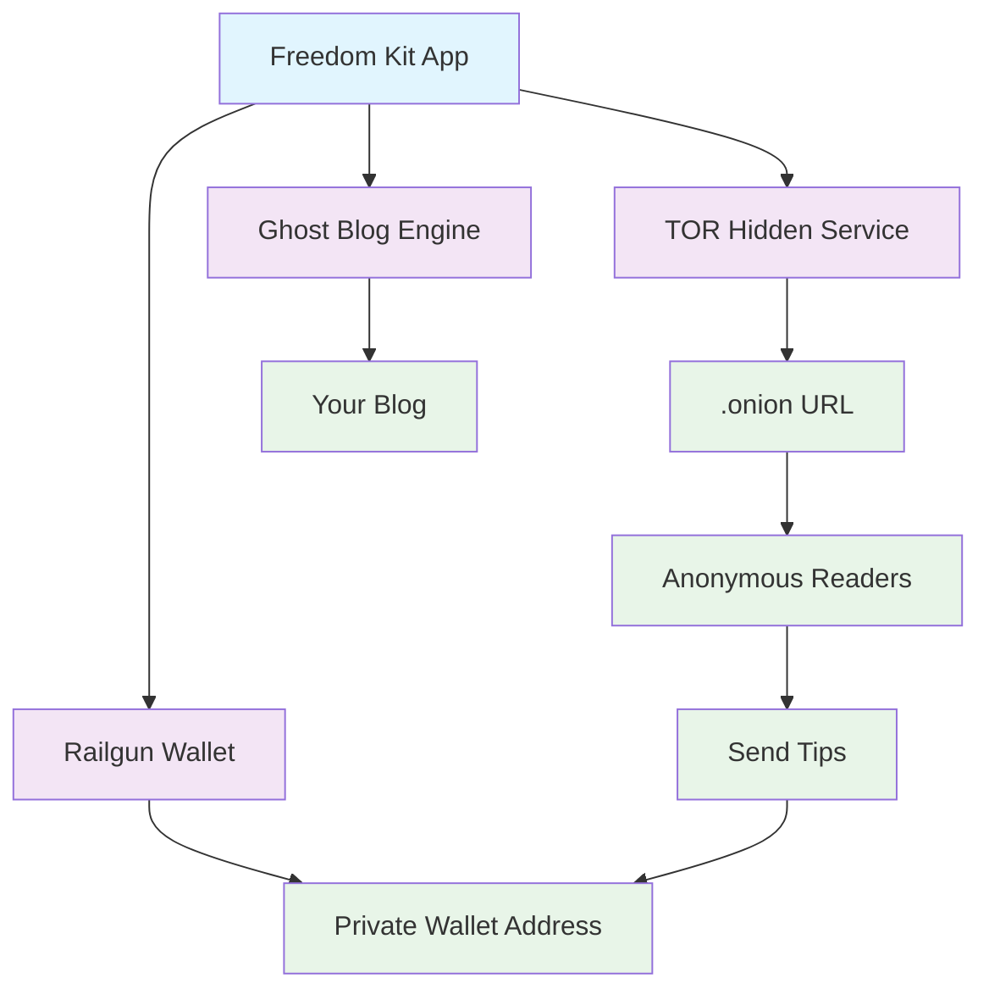

# freedom-kit

A single, multi-platform, _fool-proof_ application for activists, publishers, to use.

Freedom-kit gives you one-click access to your own anonymous blog, hidden publishing, and a private wallet.

It integrates [TOR hidden services](https://tb-manual.torproject.org/onion-services/), [Ghost](https://github.com/TryGhost/Ghost), and [railgun](https://github.com/Railgun-Community/wallet) in a single application.



[quick walkthrough demo](https://youtu.be/GD5L1Oiqlz4)

## Gist

- **Problem:** We can't expect everyday people to know what breaks, or leaks their privacy. If someone wants to share information privately, right now it requires a complicated set of tools to make it so, IF they can set it up correctly.
- **Solution:** A binary that encapsulates everything you need to remain private, with guardrails to ensure you don't screw up.
- **Impact:** Makes the web a safer place for everyone who wants to share their thoughts, and problems to the world.

## Features

- **Anonymous Blog**: Run your own Ghost blog accessible via TOR hidden service (.onion address)
- **Private Wallet**: Integrated Railgun wallet for receiving private, shielded tips
- **One-Click Setup**: Single app click with automated configuration
- **Cross-Platform**: Works on macOS, Linux, and Windows
- **No Technical Knowledge Required**: Simple GUI interface for activists and publishers

### Network Isolation

The Ghost service is unable to access the internet using a custom build [firewall](./ghost-sidecar/src/firewall.ts)

Just because something is self-hosted, it does not make it private!

Both wordpress and ghost leak the identity of the blog owner by sending traffic outside to the clearnet.

## How It Works

Freedom-kit combines three powerful privacy technologies into one seamless experience:

1. **TOR Hidden Service**: Your blog is hosted as a .onion site, making it censorship-resistant and anonymous
2. **Ghost CMS**: A beautiful, feature-rich blogging platform running locally
3. **Railgun Wallet**: Private wallet using zero-knowledge proofs for receiving shielded cryptocurrency tips



## Download Pre-built Binary

1. Go to the [Releases](../../releases) page
2. Download the appropriate binary for your platform:
   - macOS: `freedom-kit-macos.dmg`
   - Linux: `freedom-kit-linux.AppImage`
   - Windows: `freedom-kit-windows.exe`
3. Run the application

### Receiving Tips

Your readers can send you tips by:

1. Copying your Railgun address from your blog
2. Using a Railgun-compatible wallet (Railway, etc.)
3. Sending shielded transactions to your address

Tips will appear in the Freedom Kit wallet balance automatically.

⚠ This at the moment works only on Linux.

## Architecture

Freedom-kit is built using [Tauri](https://tauri.app/), a Rust-based framework for building desktop applications with web frontends.

### Components

#### 1. **Tauri App** (`/src-tauri`)

- **Rust Backend**: Handles TOR client integration, process management, and system operations
- **TOR Module**: Creates and manages hidden services for the Ghost blog
- **Sidecar Management**: Launches and monitors Ghost and Railgun services

#### 2. **Ghost Sidecar** (`/ghost-sidecar`)

- **Ghost CMS**: Bundled Ghost blogging platform (v6.3.1)
- **Compression**: Optimized distribution using compressed Ghost installation
- **Firewall**: Security layer to ensure Ghost only accepts connections via TOR

#### 3. **Railgun Sidecar** (`/railgun-sidecar`)

- **Wallet Management**: Creates and manages Railgun wallets
- **Balance Tracking**: Monitors incoming shielded transactions
- **API**: RESTful interface for wallet operations
- **Database**: Local storage for wallet state and transaction history

#### 4. **Frontend** (`/src`)

- **TypeScript/HTML/CSS**: Simple, beautiful UI
- **Wallet Setup**: Interactive wallet creation and backup
- **Status Display**: Shows onion URL and wallet address

### 📁 Project Structure

```
freedom-kit/
├── src/                    # Frontend code (HTML/TS/CSS)
├── src-tauri/              # Rust backend
│   ├── src/
│   │   ├── lib.rs          # Main Tauri application
│   │   └── tor/            # TOR integration
│   └── binaries/           # Sidecar executables
├── ghost-sidecar/          # Ghost blog sidecar
│   ├── src/                # TypeScript source
│   └── original/           # Ghost CMS files
├── railgun-sidecar/        # Railgun wallet sidecar
│   └── src/                # TypeScript source
└── README.md
```

⚠️ **Important Security Notes:**

- Keep your Railgun wallet seed phrase secure - write it down offline
- The .onion address changes if you reinstall - bookmark it
- Ghost admin credentials are generated on first run - save them securely
- This software is in active development - use at your own risk

## Known Issues

- railgun does not work in all platforms
- no formal security / traffic analysis has been done
- firewall not active on the frontend, only backend

## Roadmap

See the [todo list](#todo) at the top of this README for current development priorities.

### Planned Features

- [ ] proxy calls from the frontend to TOR
- [ ] add railgun multiplatform form support
- [ ] load application through encrypted volume (veracrypt plausibility)
- [ ] discovery of blogs / content through private mediums
- [ ] large size filesharing
